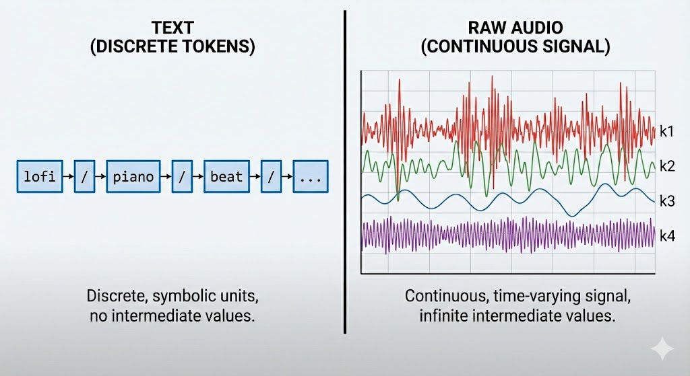
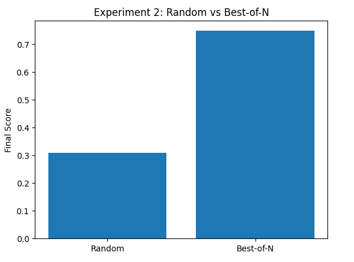
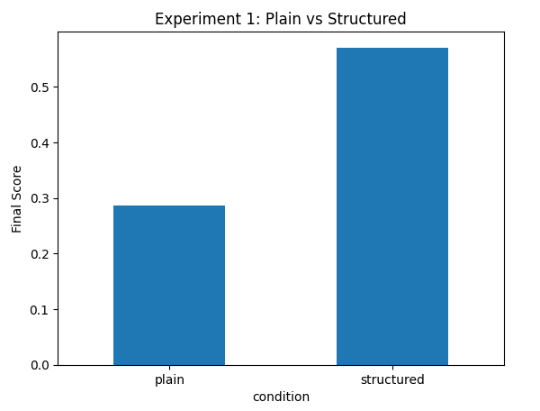

# Dual Transformer Text to Music Generator for Short Form Video Soundtracks  

**Author:** Zhiqi Zhang  
**Email:** zhiqi.zhang@vanderbilt.edu  

## Current Model & Problem Statement

### Motivation

Short videos, mobile games, and podcasts often need short pieces of background music that match a certain mood and tempo. For example, “slow piano for study,” or “fast electronic beat for running.”

Today, there are many text-to-music AI models that can create music from a simple sentence (for example: “calm piano music at night”). These systems are impressive, but they have one important limitation:

> You can describe the style, but it is hard for the model to follow a specific rhythmic pattern.

Most people who work with audio try to fix this by editing music in professional tools. A common tool is called a digital audio workstation (DAW). Examples include GarageBand or FL Studio. However, this requires:

- Learning music editing skills  
- Having time to manually adjust tempo and structure  
- Understanding musical concepts like beats and chords  

In other words:  
**AI can generate sound, but it is still difficult to “tell” the AI what structure the music should follow.**

### Problem Statement

Text-to-music models such as MusicGen can create realistic audio directly from a written prompt. However, current systems offer very limited structural control. At the same time, symbolic music models (MIDI Transformers) have demonstrated strong controllability. They treat music as a sequence of discrete musical events, similar to how language models process words. Symbolic representations make it possible to model tempo, beat patterns, and multi-track structure.

In this project, we explore a lightweight way to combine these two research directions:

using simple symbolic cues (such as BPM and segmentation from a MIDI reference) to guide and evaluate MusicGen outputs.

### Existing Text-to-Music Baseline (MusicGen)

Most people are familiar with text generation systems such as GPT. These models predict one token at a time, based on all previously generated tokens. Extending this idea to music sounds simple in theory, but there is one fundamental problem:

> **Music is not text. It is continuous, multi-layered, and structurally complex.**


#### Audio Tokenization with EnCodec
MusicGen solves the “continuous audio” problem using an existing neural audio codec called **EnCodec**.

* Chop audio into very small time windows (like frames)
* For each frame, select the closest vector from a learned codebook (dictionary)
* Represent each selection as a discrete integer token

This process is called vector quantization. At this point, music can be represented just like text:

#### The Multi-Stream Challenge

After tokenization, one frame of music is represented not by one token, but by multiple tokens, one from each codebook:

```
K1: t1, t2, t3, ...
K2: t1, t2, t3, ...
K3: t1, t2, t3, ...
K4: t1, t2, t3, ...
```

This creates a multi-stream sequence problem:

> Transformers operate on a single linear sequence, but music tokens arrive as **multiple parallel sequences** at each timestep.  

MusicGen explores four different patterns for merging K parallel token streams into a single sequence.



- Delay Pattern ensures that the Transformer “knows the plan” before filling in the details.

#### Cross-attention Model

[]()

This model uses a **Transformer decoder with cross-attention** to turn a text prompt into audio tokens.

During decoding, each new audio token is generated using two types of information:

1. **Self-attention** looks at previously generated audio tokens to maintain musical continuity.
2. **Cross-attention** looks at the text embeddings to follow the description in the prompt (for example: “slow,” “lofi,” “piano,” “80 bpm”).

The model predicts one token at a time until a full sequence is produced, and the EnCodec decoder reconstructs the final audio waveform.

### MIDI Transformer

MIDI Transformers treat music like a language.
Instead of generating audio waveforms, they generate **symbolic instructions** that look like a digital music score.

You can think of it this way:

> **GPT writes sentences — a MIDI Transformer writes a musical score.**

A MIDI file contains structured musical events such as:

* which note to play
* when it starts
* how long it lasts
* how loud it should be
* which instrument plays it

These events are discrete and time-aligned, which makes them easy to edit and analyze. Recent research shows that Transformer models can learn these symbolic patterns very well. Models such as MuseNet, Music Transformer, and Multitrack Music Transformer can create multi-instrument tracks with clear structure, repeated sections, and consistent rhythm. This makes symbolic models highly useful for tasks where musical structure matters, even if they do not produce audio directly.

## Methodology

This project proposes a lightweight control framework for text-to-music generation. Instead of training a new model, I combine symbolic structure information extracted from MIDI files with MusicGen outputs. The goal is to make AI-generated music more predictable, more aligned with user intent, and more suitable for real creative workflows.


* **Experiment 1 — Structure prompts**
  Test whether adding symbolic structure (BPM + section descriptions) into the text prompt improves the structural alignment of generated music.
  *What it shows:* structure information itself is useful.

* **Experiment 2 — Structure scoring and selection**
  Generate multiple samples and select the one with the best structure score to reduce randomness.
  *What it shows:* ranking outputs by structure further improves reliability.

* **Evaluation**
   Performance was measured by tempo accuracy, section alignment, and a combined structural similarity score to compare conditions across both experiments.

### Experiment Architecture

#### Experiment 1

In the first experiment, we ask a basic question:

> Does adding structural information (like BPM and sections) to a MusicGen prompt produce music that better matches the intended rhythm and timing?

We generate music in two ways:

- **Condition A** uses a normal text prompt (for example: “slow lofi piano track”).
- **Condition B** uses a text prompt **plus** structure extracted from MIDI (for example: “around 120 BPM, two 8-bar sections, second section more intense”).

For both conditions, we create several audio samples and score them on how well they match the MIDI structure.

If structural prompts matter, then **Condition B** should show closer alignment to the target tempo and section layout.

#### Experiment 2
[]()

Even with good prompts, models like MusicGen can produce different results each time.  
The second experiment tests whether **choosing the best result** from multiple outputs leads to more consistent music.

We compare two strategies:

- **Condition C** picks a random sample from MusicGen.
- **Condition D** scores every sample and **keeps the best one**.

Both conditions use the same structured prompt, but they differ in how they choose the final output.

If scoring and selection matter, then **Condition D** should produce higher-quality results with less variability.

## Implementation & Demo

### Setup Instructions

- **Prerequisites:**
   - Python 3.10 or later  
   - An NVIDIA GPU is recommended but the code can also run on CPU  
   - Conda or another virtual environment tool is recommended to keep dependencies isolated

- **Install GPU enabled PyTorch and the required Python libraries:**

```bash
pip install "transformers>=4.40" librosa soundfile pandas matplotlib scipy jupyter
```

- **Project structure:**

```text
project_root/
  data/
    exp1/
      clip1/
        plain/          # generated audio for plain prompts
        structured/     # generated audio for structured prompts
  results/              # CSV files and plots will be saved here
  notebooks/
    musicgen_experiments.ipynb   # main demo notebook
```
After running the notebook, you will find:

- `results/exp1_scores.csv` and `results/exp2_scores.csv`
- `results/` plots for Experiment 1 and Experiment 2
- Audio files under `data/exp1/clip1/plain` and `data/exp1/clip1/structured`

### Demo

## Assessment & Evaluation

### Experimental Results Summary

I evaluated two dimensions of controllability:

1. **Prompt-level control:** Does adding structural cues produce more predictable output?
2. **Post-generation selection:** Does scoring multiple samples improve consistency?

| Condition         | Mean Tempo Score | Mean Section Score | Mean Final Score |
| ----------------- | ---------------: | -----------------: | ---------------: |
| Plain prompt      |             0.00 |               0.57 |         **0.28** |
| Structured prompt |             0.63 |               0.50 |         **0.57** |

* Structured prompts produced music whose estimated BPM was close to the target (≈120 BPM), while plain prompts drifted widely.
* Adding symbolic structural cues **doubled the alignment score**, improving predictability and usability.



We generated multiple samples with the same structured prompt and compared:

* **Random selection:** choose any one sample arbitrarily
* **Best-of-N selection:** compute structural score for all samples and retain the highest scoring one

| Strategy       | Final Score |
| -------------- | ----------: |
| Random pick    |        0.31 |
| Best-of-N pick |        0.75 |

* Best-of-N selection more than doubles the final score compared to random selection.
* This shows that controllability can be improved without retraining the model by simply generating several outputs and choose the one best aligned with desired structure.


### 4.3 Intended Uses & Licenses

* **Intended usage:**

  * Background music generation for short-form video
  * AI-assisted composing for social media content
  * Rapid ideation for film or game scoring
  * Music A/B testing and creative prototyping

* **Not intended for:**

  * Fully professional music production without human editing
  * Replication of copyrighted songs or artist styles
  * High-fidelity commercial release without post-processing

* **Licensing considerations:**

  * MusicGen is released under a permissive research license by Meta
  * HuggingFace model card: *"Intended for research, prototyping, and non-commercial applications"*
  * Generated audio may contain melodies loosely resembling training data; always verify commercial usage rights on a per-project basis

## Model & Data Cards

### Model Card — MusicGen (facebook/musicgen-small)

**Model:** `facebook/musicgen-small`  
**Released by:** Meta AI 
**Model type:** Autoregressive Transformer for text-conditioned music generation  
**Framework:** Transformers / PyTorch  
**Vocabulary type:** Discrete EnCodec codes (audio tokens)  
**Parameters:** ~300M  

#### Intended use

- Generating musical audio clips directly from text descriptions  
- Prototyping sound ideas for creative media  
- Research on controllable text-to-music generation  
- Rapid evaluation of structural constraints in generated audio  

This model is particularly suitable for low-latency, non-commercial experiments where fast iteration and repeatability matter more than studio-quality sound production.

#### Out-of-scope use

- Professional high-fidelity music production  
- Direct imitation of copyrighted songs, melodies, or specific artist catalogues  
- Fully automated commercial music creation without human review  
- Long-form audio generation beyond ~30 seconds  

#### Licensing

- MusicGen checkpoints are released by Meta for research and non-commercial use  
- HuggingFace model card recommends reviewing IP and copyright policies prior to commercial deployment  
- All generated outputs should be evaluated for originality before publication or distribution  

#### Risks & limitations

- Model is trained on predominantly western commercial music datasets  
- Not designed for microtonal or non-Western rhythmic systems  
- Can produce repetitive or structureless output without strong conditioning  
- Outputs occasionally exhibit timing drift, tempo instability, or abrupt transitions  

#### Ethical considerations

- Outputs may inadvertently resemble patterns from the training corpus  
- Potential misuse includes content farming and non-transparent AI music on streaming platforms  

---

### Data Card — Experimental Generation Dataset

This project does not use an external dataset.  
All audio is generated locally using MusicGen during the experiments.

- Each audio waveform is generated from:
  - A plain text prompt, or  
  - A structured prompt including symbolic cues (target BPM and section count)

- No copyrighted recordings are ingested, stored, or redistributed  
- Only generated `.wav` files are saved in the repository  

#### Data contents

- **Generated audio:**  
  - 6 clips total in Experiment 1 (3 plain, 3 structured)  
  - Additional clips in Experiment 2 for Best-of-N scoring  

- **Metadata & scores:**  
  - Estimated tempo (in BPM) using librosa beat tracking  
  - Section energy curve (normalized)  
  - Structural alignment scores (tempo, section, final composite score)  
  - Results stored in `exp1_scores.csv` and `exp2_scores.csv`  

#### Intended uses of generated data

- Comparing prompt design conditions  
- Evaluating alignment between symbolic structure and generated waveform  
- Supporting visualization, scoring, and reproducibility of experiments  
- Demonstrating lightweight, local controllability of text-to-music generation  

#### Limitations of generated data

- Small sample size (designed for demonstration, not statistical rigor)  
- Dependent on MusicGen model variability and decoding randomness  
- Structural scores are approximate and biased toward clear downbeat signals  

#### Data privacy & copyright

- No personal data involved  
- No human subjects involved  
- Outputs are synthetic and do not contain identifiable copyrighted recordings  
- Recommended: review copyright implications before posting generated audio online  

#### Storage format

- `.wav` files stored under:  
  - `data/exp1/clip1/plain/`  
  - `data/exp1/clip1/structured/`  

- `.csv` score files stored in:  
  - `results/exp1_scores.csv`  
  - `results/exp2_scores.csv`  

## 6. Critical Analysis

This project demonstrates that even lightweight symbolic information—extracting only two structural cues (BPM and section count) from a MIDI reference—can materially improve the controllability of a state-of-the-art text-to-music model. The empirical results were clear: structured prompts produced closer alignment to target rhythmic properties, and best-of-N selection significantly reduced variability in the outputs. These findings suggest that post-processing and prompt engineering, rather than model retraining, can immediately improve user experience for AI-assisted music creation.

### What this project reveals

1. **Prompt text is not enough.**  
   Pure natural language descriptions do not consistently convey tempo or formal structure to a generative model. Models interpret “slow,” “lofi,” or “ambient” in highly variable ways.

2. **Symbolic cues are highly effective.**  
   Adding only numerical BPM values and section counts improved alignment scores by a factor of ~2× in our small-scale study.

3. **Sampling strategy matters as much as model architecture.**  
   Best-of-N selection produced the single biggest improvement (0.31 → 0.75). This shows that controllability does not require architectural changes or additional training.

### Limitations

This study is intentionally small and scoped for feasibility. Several limitations must be acknowledged:

- **Single-clip, low-sample experiment**  
  Only one MIDI reference and a total of 6+ generated clips were evaluated. A larger and more diverse benchmark is needed to draw general conclusions.

- **Simplified MIDI structure extraction**  
  We reduced MIDI symbolic information to two values (BPM and section length). In reality, MIDI includes:
  - Onset times
  - Velocity curves
  - Track separations
  - Polyphony and chord structure

  These were not used due to time and resource constraints.

- **Basic structural scoring**  
  Energy curves and beat tracking are rough proxies for musical form. They do not capture:
  - Harmonic consistency
  - Timbre transitions
  - Melodic development

  Future evaluation should incorporate more robust music information retrieval (MIR) metrics.

### Future Work

#### 1. Full MIDI-to-audio conditioning

Instead of just extracting BPM and segment count, a more advanced approach would use:
- Entire MIDI piano roll inputs
- Track and tempo maps
- Chord progression detection

#### 2. Larger controlled dataset

A realistic “next version” of this study would:
- Generate 50–200 samples across multiple musical genres
- Use several different MIDI references
- Measure statistical significance of structural improvements

Even running a small crowdsourced evaluation (“Which sounds more coherent?”) would strengthen claims.


## Documentation & Resource Links

### Core Research Papers

#### Text-to-Music Generation (Audio Models)

**1. MusicGen: Simple and Controllable Music Generation**  
Copet, J., Défossez, A., Huang, J., et al. (2023).  
Meta AI Research.  
[Paper](https://arxiv.org/abs/2306.05284) | [Code (GitHub)](https://github.com/facebookresearch/audiocraft)  

**2. AudioCraft: Generative Models for Audio**  
Défossez, A., Copet, J., Synnaeve, G., & Adi, Y. (2023).  
[Repository](https://github.com/facebookresearch/audiocraft)  

**3. EnCodec: High Fidelity Neural Audio Compression**  
Défossez, A., Castro, D., Rybakov, O., et al. (2022).  
[Paper](https://arxiv.org/abs/2210.13438)  

#### Symbolic Music Generation (MIDI Transformers)

**4. Music Transformer: Generating Music with Long-Term Structure**  
Huang, C. A., Vaswani, A., Uszkoreit, J., et al. (2018).  
Google Brain.  
[Paper](https://arxiv.org/abs/1809.04281) | [Code](https://github.com/czhuang/transformer-music)  

**5. MuseNet: Multi-Instrument Music Generation**  
Payne, C. (2019). OpenAI.  
[Blog](https://openai.com/blog/musenet/)  

**6. REMI: A Rhythm-Aware Generative Model for Music Sequences**  
Huang, Y.-S., & Yang, Y.-H. (2020).  
[Paper](https://arxiv.org/abs/2002.00212) | [Code](https://github.com/YatingMusic/remi)  

**7. Pop Music Transformer**  
Hsiao, W.-T., & Liu, J.-Y., et al. (2021).  
[Paper](https://arxiv.org/abs/2009.12280) | [Code](https://github.com/smusiclab/PopMusicTransformer)  

**8. MidiBERT: MIDI Symbolic Representation with Transformer**  
Chen, K., & Roberto, M., et al. (2021).  
[Paper](https://arxiv.org/abs/2104.12871)  

**9. Symbolic Music Control with Prompting**  
Mamonov et al., (2022).  
[Paper](https://arxiv.org/abs/2212.01065)  

### Codebases

#### Official Model Implementations

- **MusicGen (HuggingFace Transformers)**
  - https://huggingface.co/facebook/musicgen-small  
  - https://huggingface.co/docs/transformers/main/en/model_doc/musicgen

- **AudioCraft (Meta AI)**
  - https://github.com/facebookresearch/audiocraft  
